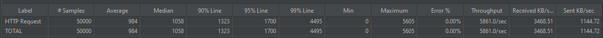
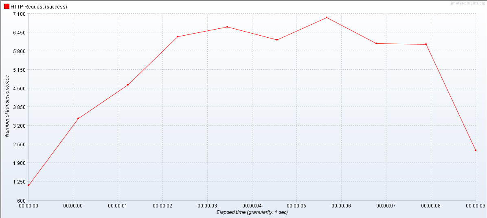

# 트러블 슈팅

# 쿼리 분석
```
- 목적 : 팔로우 목록 조회 속도 최적화 
- 방법 : JMeter를 통해 세가지 방식의 쿼리문에 대한 1만개 요청 처리 속도 비교
  [1] 연관관계가 없는 경우
  [2] 양방향의 연관관계가 있는 경우
  [3] 복합키를 사용한 경우
```

[1] 연관관계가 없는 경우
- 회원 | 팔로우 각각 별도로 작업
```java
@Entity
// 어노테이션 생략
public class Member {

    @Id
    @GeneratedValue
    @Column(name = "member_id")
    private Long id;

    private long followCnt;
    private long followerCnt;

}
```
```java
@Entity
// 어노테이션 생략
public class Follow {

  @Id
  @GeneratedValue(strategy = GenerationType.IDENTITY)
  @Column(name = "follow_id")
  private Long id;

  private Long requesterId;
  private Long targetId;
  private boolean followStatus;

}
```
- 서비스에서 회원 팔로우 목록을 가져오는 서비스
```java
public FollowList.Response getFollowList(String requesterEmail, FollowList.Request request) {

    Member requester = memberRepository.findByEmail(requesterEmail)
            .orElseThrow(() -> new FollowException(FOLLOW_REQUESTER_NOT_FOUND));

    PageRequest pageRequest = PageRequest.of(request.getPageNumber() - 1, request.getRecordSize()
            , Sort.Direction.valueOf(request.getSortOrder().toUpperCase(Locale.ROOT)), request.getSortBy());

    PointDirection pointDirection = PointDirection.valueOf(request.getPointDirection());

    Page<Follow> pageResult;
    List<FollowMember> followMembers;
    if (FOLLOWS.equals(pointDirection)) {
        pageResult = followRepository.findAll(pageRequest);
        followMembers = addMemberInfoToFollowResult(pageResult);
    } else  {
        pageResult = followRepository.findAllByTargetId(requester.getId(), pageRequest);
        followMembers = addMemberInfoToFollowResult(pageResult);
    }

    return FollowList.Response.fromEntity(requester.getId(), request, pageResult, followMembers);
}

private List<FollowMember> addMemberInfoToFollowResult(Page<Follow> follows) {

    List<FollowMember> followMembers = new ArrayList<>();

    for (Follow follow : follows.getContent()) {
        Member member = memberRepository.findById(follow.getTargetId())
                .orElseThrow(() -> new FollowException(FOLLOW_TARGET_NOT_FOUND));

        FollowMember followMember = FollowMember.fromEntity(member);
        followMember.setFollowStatus(follow.isFollowStatus());
        followMembers.add(followMember);
    }

    return followMembers;
}
```
- 콘솔에 출력된 쿼리문 :
  1. 회원 정보를 두 번 불러온 후, (+2N)
  2. 팔로우 목록을 조회하고 (+N)
  3. 팔로우 목록 수만큼 회원 정보를 조회한다.(+N)

- JMeter에 출력된 결과 : 1만 개의 샘플을 5번의 루프로 돌린 결과
  1) 하나의 요청당 평균 ms 속도로 처리 되었으며,
  2) 초당 트랜잭션 수(TPS)는 가장 많을 때 약 개가 나타났다.

[2] 양방향 연관관계가 있는 경우
- 회원 <-> 팔로우
```java
@Entity
// 어노테이션 생략
public class Member {

    @Id
    @Column(name = "member_id")
    @GeneratedValue(strategy = GenerationType.IDENTITY)
    private Long memberId;
    
    @OneToMany(mappedBy = "requester")
    private List<Follow> followList;
    @OneToMany(mappedBy = "target")
    private List<Follow> followerList;

}
```
```java
@Entity
// 어노테이션 생략
public class Follow {

    @Id
    @GeneratedValue(strategy = GenerationType.IDENTITY)
    @Column(name = "follow_id", nullable = false)
    private Long followId;

    @ManyToOne
    @JoinColumn(name = "requester_id")
    private Member requester;

    @ManyToOne
    @JoinColumn(name = "target_id")
    private Member target;

    public void changeRequester(Member requester){
        this.requester = requester;
        if (!requester.getFollowList().contains(this)) {
            requester.getFollowList().add(this);
        }
    }

    public void changeTarget(Member target){
        this.target = target;
        if (!target.getFollowerList().contains(this)){
            target.getFollowerList().add(this);
        }
    }
}
```
- 서비스에서 회원 팔로우 목록을 가져오는 메소드
```java
public FollowListResponse findFollowList(String email, CustomPage requestPage) {

    Member member = memberRepository.findByEmail(email)
    .orElseThrow(() -> new RuntimeException("Member Not Found"));
    
    List<MemberShortInfo> followList = findFollowingMemberShortList(requestPage, member);
    return FollowListResponse.fromEntity(FOLLOWS, requestPage, member, followList);
}

private List<MemberShortInfo> findFollowingMemberShortList(CustomPage requestPage, Member member) {

    List<Follow> myFollowList = member.getFollowList();
    List<Follow> subFollowList = getSubFollowListByPage(requestPage, myFollowList);

    return subFollowList.stream()
                        .map(Follow::getTarget)
                        .map(MemberShortInfo::fromEntity)
                        .collect(Collectors.toList());
}
```
- 콘솔에 출력된 쿼리문 : 
  1) 회원 데이터를 한 번 가져온 뒤에
  2) 회원의 팔로우 목록을 조회할 때 회원 + 팔로우 조인 쿼리 발생 
```
select
    member0_.member_id as member_i1_1_0_,
    // 생략 (회원 전체 칼럼)
from
    member member0_ 
where
    member0_.member_id=?;
```
```
select
    followlist0_.requester_id as requeste4_0_0_,
    // 생략 (팔로우 전체 칼럼)
    member1_.member_id as member_i1_1_2_,
    // 생략 (회원 전체 칼럼)
from
    follow followlist0_
        left outer join
    member member1_
    on followlist0_.target_id=member1_.member_id
where
    followlist0_.requester_id=?
```
- JMeter에 출력된 결과 : 1만 개의 샘플을 5번의 루프로 돌린 결과
  1) 하나의 요청당 평균 984ms 속도로 처리 되었으며,
  2) 초당 트랜잭션 수(TPS)는 가장 많을 때 약 7000개가 나타났다.




