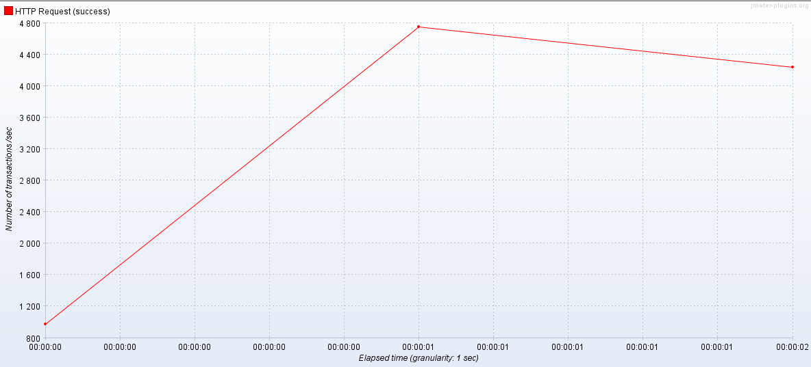
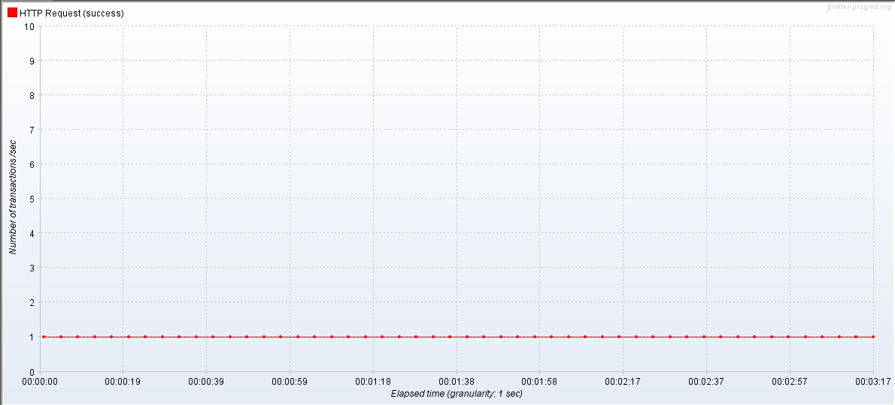
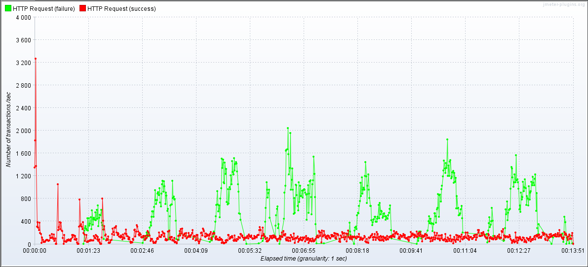
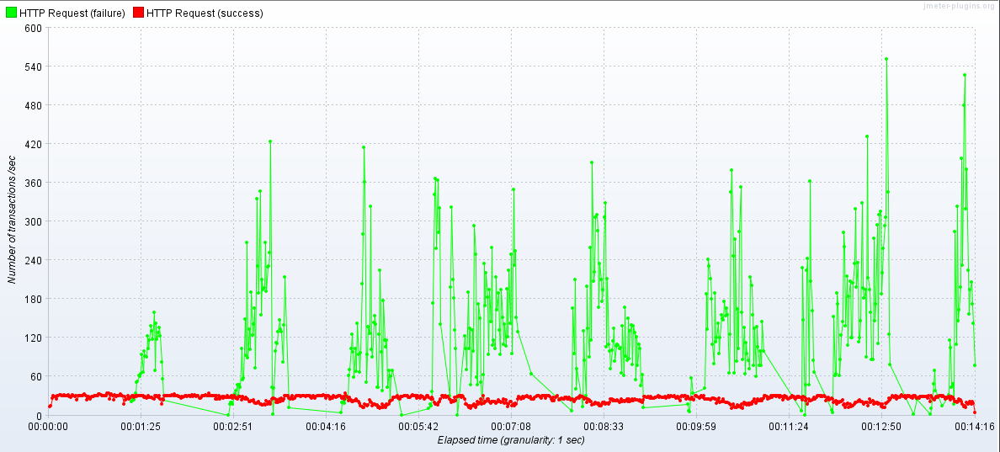
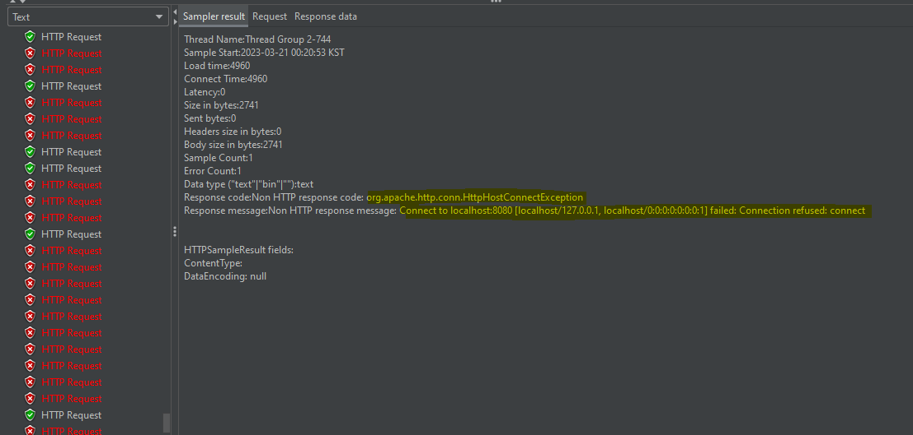
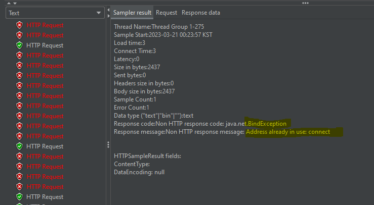
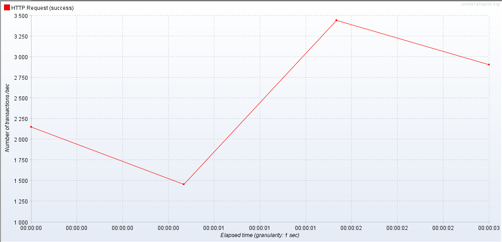

# 1. 트러블 슈팅
## ISSUE 1. member cannot be cast to class
```java
class com.ecloth.beta.member.entity.member cannot be cast to class java.io.serializable
```
- 원인 : 회원 엔터티의 크기가 너무 커져서 Json으로 직렬화가 안 되고 있다.
- 해결 : Serializable을 implements하고, private final static long serialVersionUID = 1L 을 붙여줬다.

## ISSUE 2. 406 에러 Not Acceptable 반환
```java
@AllArgsConstructor
public class ChatRoomCreateResponse implements Serializable {

    private static final long serialVersionUID = 1L;

    private Long chatRoomId;

    public static ChatRoomCreateResponse fromEntity(ChatRoom newChatRoom) {
        return new ChatRoomCreateResponse(newChatRoom.getChatRoomId());
    }
}
```
- 원인 : 컨트롤러의 ResponseEntity에 담기는 DTO에 Getter가 없어, Jackson 라이브러리가 Json으로 직렬화를 하지 못함
- 해결 : @Getter를 붙이고, Snake 방식으로 반환하기 위해 @JsonNaming Annotaion을 붙여주었다.

## ISSUE 3. MultipartFile Minimum Size Error
```java
org.apache.tomcat.util.http.fileupload.impl.FileSizeLimitExceededException: The field images exceeds its maximum permitted size of 1048576 bytes.
```
- 원인 : 디폴트 값인 1048576 bytes (약 1MB) 을 넘어서는 image를 전달했기 때문
- 해결 : 아래와 같이 설정값을 추가했다.
```java
spring.servlet.multipart.maxFileSize=10MB
spring.servlet.multipart.maxRequestSize=10MB
```

## ISSUE 4. MultipartFile Minimum Size Error
```java
'java.lang.String' to required type 'org.springframework.web.multipart.MultipartFile' for property 'images[0]': no matching editors or conversion strategy found]]
```
- 원인 : MultipartFile[] 타입인 images 변수값을 null 값으로 받을 때 bindException이 나타남 
- 해결 : 컨트롤러에 @RequestParam(value = "file", required = false) 로 images를 따로 뽑아 해결 
- 해결 후 변동 : 포스트 등록 시 이미지를 1개 이상 저장하는 것으로 로직이 수정되어 위 코드에서 아래 예외 사항을 추가
```java
@PostMapping(value = "/feed/post", consumes = {"multipart/form-data"})
public ResponseEntity<?> postCreate(@ApiIgnore @AuthenticationPrincipal MemberDetails memberDetails,
                                    @RequestParam(value = "file", required = false) MultipartFile[] images,
                                    PostingCreateRequest request) throws Exception {

    request.setMemberId(memberDetails.getMemberId());

    if (ArrayUtils.isEmpty(request.getImages())) {
        return new ResponseEntity<>("이미지를 1개 이상 등록해주세요.", HttpStatus.BAD_REQUEST);
    }

    postingService.createPost(images, request);

    return ResponseEntity.ok().build();
}
```

<br>

# 2. 쿼리 분석
```
- 목적 : 팔로우 목록 조회 속도 최적화 
- 방법 : 세가지 방식의 쿼리문을 비교하고 JMeter를 통해 부하 테스트
  [1] 연관관계 없이 회원 id를 통해 팔로우 목록을 조회하는 경우 
  [2] 회원 <-> 팔로우 양방향 연관관계에서 회원의 팔로우 목록을 조회하는 경우 
  [3] 회원 <-> 팔로우 양방향 연관관계에서 fetch join으로 회원의 팔로우 목록을 조회하는 경우
```

### [1] 연관관계 없이 회원 id를 통해 팔로우 목록을 조회하는 경우
- 회원 | 팔로우 각각 별도로 작업
```java
@Entity
// 어노테이션 생략
public class Member {

    @Id
    @GeneratedValue
    @Column(name = "member_id")
    private Long id;

    private long followCnt;
    private long followerCnt;

}
```
```java
@Entity
// 어노테이션 생략
public class Follow {

  @Id
  @GeneratedValue(strategy = GenerationType.IDENTITY)
  @Column(name = "follow_id")
  private Long id;

  private Long requesterId;
  private Long targetId;
  private boolean followStatus;

}
```
- 서비스에서 회원 팔로우 목록을 가져오는 서비스
```java
public FollowList.Response getFollowList(String requesterEmail, FollowList.Request request) {

    // 쿼리문 1. 회원 정보를 가져온다.
    Member requester = memberRepository.findByEmail(requesterEmail)
            .orElseThrow(() -> new FollowException(FOLLOW_REQUESTER_NOT_FOUND));
    
    PageRequest pageRequest = PageRequest.of(request.getPageNumber() - 1, request.getRecordSize()
            , Sort.Direction.valueOf(request.getSortOrder().toUpperCase(Locale.ROOT)), request.getSortBy());

    PointDirection pointDirection = PointDirection.valueOf(request.getPointDirection());

    Page<Follow> pageResult;
    List<FollowMember> followMembers;
    if (FOLLOWS.equals(pointDirection)) {
        // 쿼리문 2. 회원의 팔로우 정보를 가져온다.(N개의 팔로우 정보)
        pageResult = followRepository.findAll(pageRequest);
        followMembers = addMemberInfoToFollowResult(pageResult);
    } else  {
        pageResult = followRepository.findAllByTargetId(requester.getId(), pageRequest);
        followMembers = addMemberInfoToFollowResult(pageResult);
    }
    
    return FollowList.Response.fromEntity(requester.getId(), request, pageResult, followMembers);
}

private List<FollowMember> addMemberInfoToFollowResult(Page<Follow> follows) {

    List<FollowMember> followMembers = new ArrayList<>();

    for (Follow follow : follows.getContent()) {
        // 쿼리문 3. 팔로우하고 있는 대상의 회원 정보를 가져온다. (M개의 회원정보)
        Member member = memberRepository.findById(follow.getTargetId())
                .orElseThrow(() -> new FollowException(FOLLOW_TARGET_NOT_FOUND));
        
        FollowMember followMember = FollowMember.fromEntity(member);
        followMember.setFollowStatus(follow.isFollowStatus());
        followMembers.add(followMember);
    }

    return followMembers;
}
```
- 위의 경우 총 1 x N x M 의 쿼리를 사용한다.
  1. 회원 정보를 불러온 후, (1)
  2. 팔로우 목록을 조회하고 (N)
  3. 팔로우 목록 수만큼 회원 정보를 조회하고 팔로우, 팔로워 카운트를 올린다.(M)
- 결론 : 너무 많은 쿼리문을 반복적으로 생성하며, 객체 지향적인 코드라 보기 어려움
- 대안 : JPA를 통해 회원 <-> 팔로우의 양방향 연관관계를 생성한다. 

### [2] 회원 <-> 팔로우 양방향 연관관계에서 회원의 팔로우 목록을 조회하는 경우
- 회원 <-> 팔로우
```java
@Entity
// 어노테이션 생략
public class Member {

    @Id
    @Column(name = "member_id")
    @GeneratedValue(strategy = GenerationType.IDENTITY)
    private Long memberId;
    
    @OneToMany(mappedBy = "requester")
    private List<Follow> followList;
    @OneToMany(mappedBy = "target")
    private List<Follow> followerList;

}
```
```java
@Entity
// 어노테이션 생략
public class Follow {

    @Id
    @GeneratedValue(strategy = GenerationType.IDENTITY)
    @Column(name = "follow_id", nullable = false)
    private Long followId;

    @ManyToOne
    @JoinColumn(name = "requester_id")
    private Member requester;

    @ManyToOne
    @JoinColumn(name = "target_id")
    private Member target;
    
}
```
- 서비스에서 회원 팔로우 목록을 가져오는 메소드
```java
public FollowListResponse findFollowList(String email, CustomPage requestPage) {

    // 쿼리문 1. 회원을 조회한다.
    Member member = memberRepository.findByEmail(email)
    .orElseThrow(() -> new RuntimeException("Member Not Found"));
    
    List<MemberShortInfo> followList = findFollowingMemberShortList(requestPage, member);
    return FollowListResponse.fromEntity(FOLLOWS, requestPage, member, followList);
}

private List<MemberShortInfo> findFollowingMemberShortList(CustomPage requestPage, Member member) {

    // 쿼리문 2. 회원의 팔로우 목록을 가져온다. (연관관계 이용) 
    List<Follow> myFollowList = member.getFollowList();
    List<Follow> subFollowList = getSubFollowListByPage(requestPage, myFollowList);

    return subFollowList.stream()
                        .map(Follow::getTarget)
                        .map(MemberShortInfo::fromEntity)
                        .collect(Collectors.toList());
}
```
- 콘솔에 출력된 쿼리문 : 
  1) 회원 데이터를 한 번 가져온 뒤에
  2) 회원의 팔로우 목록을 조회할 때 회원 + 팔로우 조인 쿼리 발생 
```
Hibernate: 
    select
        member0_.member_id as member_i1_1_0_,
        member0_.register_date as register2_1_0_,
        member0_.update_date as update_d3_1_0_,
        member0_.email as email4_1_0_,
        member0_.email_auth_code as email_au5_1_0_,
        member0_.email_auth_date as email_au6_1_0_,
        member0_.latitude as latitude7_1_0_,
        member0_.longitude as longitud8_1_0_,
        member0_.member_role as member_r9_1_0_,
        member0_.member_status as member_10_1_0_,
        member0_.nickname as nicknam11_1_0_,
        member0_.password as passwor12_1_0_,
        member0_.password_reset_code as passwor13_1_0_,
        member0_.password_reset_request_date as passwor14_1_0_,
        member0_.phone as phone15_1_0_,
        member0_.profile_image_path as profile16_1_0_ 
    from
        member member0_ 
    where
        member0_.member_id=?
Hibernate: 
    select
        followlist0_.requester_id as requeste4_0_0_,
        followlist0_.follow_id as follow_i1_0_0_,
        followlist0_.follow_id as follow_i1_0_1_,
        followlist0_.register_date as register2_0_1_,
        followlist0_.update_date as update_d3_0_1_,
        followlist0_.requester_id as requeste4_0_1_,
        followlist0_.target_id as target_i5_0_1_,
        member1_.member_id as member_i1_1_2_,
        member1_.register_date as register2_1_2_,
        member1_.update_date as update_d3_1_2_,
        member1_.email as email4_1_2_,
        member1_.email_auth_code as email_au5_1_2_,
        member1_.email_auth_date as email_au6_1_2_,
        member1_.latitude as latitude7_1_2_,
        member1_.longitude as longitud8_1_2_,
        member1_.member_role as member_r9_1_2_,
        member1_.member_status as member_10_1_2_,
        member1_.nickname as nicknam11_1_2_,
        member1_.password as passwor12_1_2_,
        member1_.password_reset_code as passwor13_1_2_,
        member1_.password_reset_request_date as passwor14_1_2_,
        member1_.phone as phone15_1_2_,
        member1_.profile_image_path as profile16_1_2_ 
    from
        follow followlist0_ 
    left outer join
        member member1_ 
            on followlist0_.target_id=member1_.member_id 
    where
        followlist0_.requester_id=?

```
- JMeter 테스트 :
    - 아래의 총 5가지 테스트 케이스를 만들어 테스트 진행
    - (1) 케이스 1 : 1초에 100명의 사용자가 로그인과 팔로우 목록 조회 요청을 하는 상황이 200번 반복
      - [보기1] 팔로우 TPS(Transaction per second)
      
      - [보기2] 회원 TPS
      
    - (2) 케이스 2 : 1초에 5000명의 사용자가 팔로우 목록 조회 요청을 보내는 와중에 로그인 요청이 1000번 발생하는 경우가 200번 반복
      - [보기3] 팔로우 TPS
      
      - [보기4] 회원 TPS
      
      - [보기5] 팔로우 & 회원 오류 내용
        
        

```
 결과 :
   - 케이스2에서 팔로우 처리 속도는 평균 10초, 오류 72%, 처리량 496.9 TPS
   - 오류
     (1) HttpHostConnectedException 
      : 부하로 인해 팔로우 목록 조회 HTTP 요청 또는 로그인 요청이 거부된 상황
      ㄴ 해결 방법 : 쿼리 요청을 최소화 - 양방향 연관관계를 단방향으로 전환, 불필요한 회원 조회를 줄인다. 
     (2) BindException - Address already in use:connect 발생
      : TCP 연결을 위한 소켓 작업이 한 번에 다수가 몰리면서 시스템 리소스가 소진되어 나타나는 현상 (윈도우 디폴트 1024-5000 소진)
      ㄴ 해결 방법 : 부하 분산을 통한 원인 방지 (현재 단계에서는 불필요)
``` 

### [3] 회원 <-> 팔로우 양방향 연관관계에서 fetch join으로 회원의 팔로우 목록을 조회하는 경우
```java
 @Query("select f from Follow f join fetch f.target where f.requester.memberId = :memberId")
    List<Follow> findFollowListByRequesterId(Long memberId);
```
- 쿼리문
```java
Hibernate: 
    select
        follow0_.follow_id as follow_i1_0_0_,
        member1_.member_id as member_i1_1_1_,
        follow0_.register_date as register2_0_0_,
        follow0_.update_date as update_d3_0_0_,
        follow0_.requester_email as requeste4_0_0_,
        follow0_.target_id as target_i5_0_0_,
        member1_.register_date as register2_1_1_,
        member1_.update_date as update_d3_1_1_,
        member1_.email as email4_1_1_,
        member1_.email_auth_code as email_au5_1_1_,
        member1_.email_auth_date as email_au6_1_1_,
        member1_.latitude as latitude7_1_1_,
        member1_.longitude as longitud8_1_1_,
        member1_.member_role as member_r9_1_1_,
        member1_.member_status as member_10_1_1_,
        member1_.nickname as nicknam11_1_1_,
        member1_.password as passwor12_1_1_,
        member1_.password_reset_code as passwor13_1_1_,
        member1_.password_reset_request_date as passwor14_1_1_,
        member1_.phone as phone15_1_1_,
        member1_.profile_image_path as profile16_1_1_ 
    from
        follow follow0_ 
    inner join
        member member1_ 
            on follow0_.target_id=member1_.member_id cross 
    join
        member member2_ 
    where
        follow0_.requester_email=member2_.email 
        and member2_.member_id=?
Hibernate: 
    select
        member0_.member_id as member_i1_1_0_,
        member0_.register_date as register2_1_0_,
        member0_.update_date as update_d3_1_0_,
        member0_.email as email4_1_0_,
        member0_.email_auth_code as email_au5_1_0_,
        member0_.email_auth_date as email_au6_1_0_,
        member0_.latitude as latitude7_1_0_,
        member0_.longitude as longitud8_1_0_,
        member0_.member_role as member_r9_1_0_,
        member0_.member_status as member_10_1_0_,
        member0_.nickname as nicknam11_1_0_,
        member0_.password as passwor12_1_0_,
        member0_.password_reset_code as passwor13_1_0_,
        member0_.password_reset_request_date as passwor14_1_0_,
        member0_.phone as phone15_1_0_,
        member0_.profile_image_path as profile16_1_0_ 
    from
        member member0_ 
    where
        member0_.email=?
[2023-03-23 18:26:13.042] [INFO ] [http-nio-8080-exec-201] com.ecloth.beta.follow.service.FollowService FollowService.findFollowList : 회원 1의 팔로우 수는 2

```
- JMeter 테스트 결과



```
 결과 : 
 - 트래픽 수가 1만명 일 때,
   - 처리 속도는 평균 450ms, 오류 00%, 처리량 1853.6 TPS
 - 트래픽 수가 5천명 일 때,
   - 처리 속도는 평균 584ms, 오류 00%, 처리량 2193.9 TPS
```